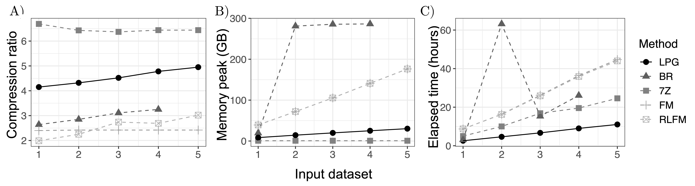

#


A grammar compressor for massive and repetitive datasets.
The word LPG stands for the three key concepts underlying our technique,
which are **L**MS-based suffix sorting, **P**airing and **G**rammar compression.  

## Why LPG?
1. The memory footprint for compressing the input is low 
2. Highly paralelizable
3. It allows parallel decompression and random access to the strings
4. It produces the BWT of the collection without fully decompressing the data 

## Motivation

 Our motivation is to perform in succinct space string analyses that require
 complex string queries not yet supported by repetition-based self-indexes.
 We envision an approach in which we store the input collection as a grammar, but when required,
 we compute its BWT to carry out the analysis by using self-indexes.
 
 We consider our tool particularly useful for genomic analyses, where the biological information have to be retrieved from
 huge collections of short and overlapping strings called *sequencing reads*.

## Third-party libraries

1. [SDSL-lite](https://github.com/simongog/sdsl-lite)
2. [xxHash](https://github.com/Cyan4973/xxHash)

## Prerequisites

1. C++ >= 14
2. CMake >= 3.7
3. SDSL-lite

The xxHash library is already included in the source files of LPG. We include a CMake module that will search for
the local installation of the SDSL-library. No need to indicate the path during the compilation of LPG.

## Installation

Clone repository, enter the project folder and execute
the following commands:

```
mkdir build
cd build
cmake ..
make
```

## Compressing
```
./lpg tests/sample_file.txt
```

By default, LPG will replace the uncompressed input and will run with one thread.
To keep the input or running with more threads please see the help (-h). 

## Decompressing

```
./lpg -d sample_file.txt.lpg
```

## Results

We compared LPG against other compression tools. For all programs we used 10 threads, when possible. 


| Input | Plain size (GB) |        Data description   | Alphabet |
|:-----:|:---------------:|:-------------------------:|:--------:|
|   1   |      12.77      | Illumina sequencing reads |     6    |
|   2   |      23.43      | Illumina sequencing reads |     6    |
|   3   |      34.30      | Illumina sequencing reads |     6    |
|   4   |      45.89      | Illumina sequencing reads |     6    |
|   5   |      57.37      | Illumina sequencing reads |     6    |

**Table 1**. Description of the input collections used in the experiments.


**Figure 1**. Performance of different compressors. BR is BigRepair, 7Z is 7z-zip, FM is the FM-index and
RLFM is the Run-Length Compressed FM-index. The compression ratio is measured as the size of the plain input size
divided by the size of the compressed representation. Except for BR, the compression ratio values do not consider the
space overhead for random accession to the strings.

## How to cite LPG? 

For the moment, please cite the following arXiv preprint:

```
@article{ddd2020agr,
  title={A grammar compressor for collections of reads with applications to the construction of the {BWT}},
  author={Diaz-Dominguez, D. and Navarro, G.},
  journal={arXiv preprint arXiv:x},
  year={2020}
}  
```


